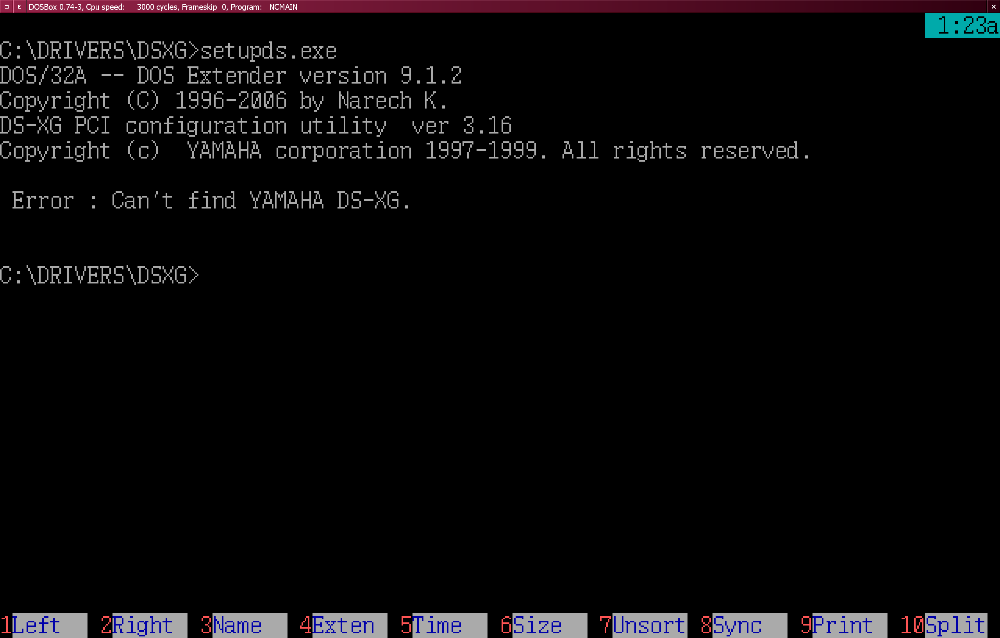

# Yamaha DS-XG driver for DOS

 - The [`dos32a-bound/`](dos32a-bound/) directory contains a `setupds.exe`
   executable linked with the [_DOS/32A_](https://github.com/amindlost/dos32a)
   extender, hence the removal of `dos4gw.exe` file.
 - The [`stub-dos4gw/`](stub-dos4gw/) directory contains the `dos4gw.exe` file
   replaced with `dos32a.exe`. This is the "drop-in replacement" scenario:
   
 - The [`stub32a/`](stub32a/) directory contains a `setupds.exe` executable
   linked with `stub32a.exe`.
 - The [`stub32c/`](stub32c/) directory contains a `setupds.exe` executable
   linked with `stub32c.exe`.

---

In all of the above cases, version **9.1.2** of the _DOS/32A_ extender was
used.
